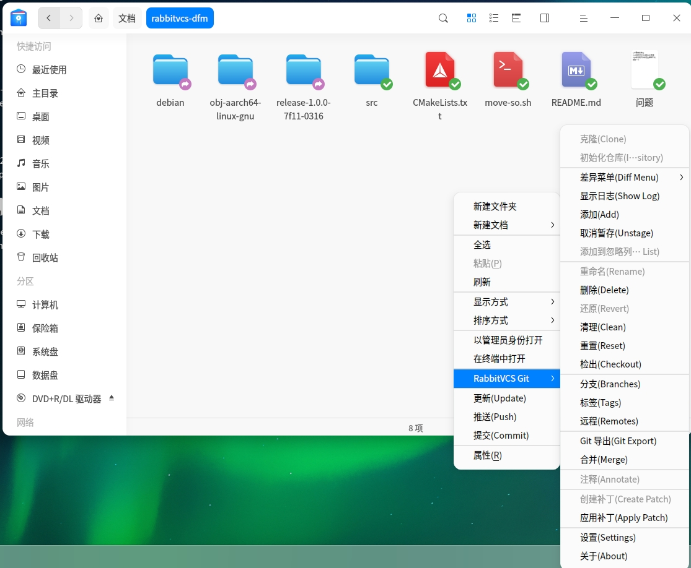

# RabbitVCS DFM

为 DDE 文件管理器 (dde-file-manager) 添加 RabbitVCS 版本控制支持的扩展插件。

## 功能特性

- **菜单集成**: 在文件右键菜单中添加 SVN/Git 操作
- **角标显示**: 根据文件版本控制状态显示角标图标
- **多版本控制支持**: 支持 SVN、Git、Mercurial
- **完整功能**: 包括检出、提交、更新、推送、分支、标签等所有常用操作

## 安装

### 依赖

- `dde-file-manager` (>= 5.x)
- `rabbitvcs` (包括 rabbitvcs-cli)
- `qtbase5-dev`
- `libqt5dbus5`
- `cmake` (>= 3.10)
- `git` 或 `subversion`

### 编译

```bash
mkdir build && cd build
cmake ..
make
```

### 安装

```bash
sudo make install
```

## 使用方法

安装后,重新启动 dde-file-manager:

```bash
killall dde-file-manager
dde-file-manager
```

现在在 SVN 或 Git 仓库目录中,右键点击文件或空白区域即可看到 RabbitVCS 菜单项。

## 功能说明

### 右键菜单示例

在版本控制仓库中的文件或文件夹上右键,会显示以下菜单项:



### 菜单项说明

在版本控制仓库中的文件或文件夹上右键,会显示以下菜单项:

- **Update** - 更新到最新版本
- **Commit** - 提交更改
- **Push** - 推送更改(Git/Hg)
- **RabbitVCS SVN** - SVN 子菜单
- **RabbitVCS Git** - Git 子菜单

### SVN 子菜单

包含所有常用的 SVN 操作:
- Checkout
- Diff (包括比较工具、显示更改)
- Show Log
- Add/Delete/Revert
- Branch/Tag/Switch
- Merge
- Properties
- 等等

### Git 子菜单

包含所有常用的 Git 操作:
- Clone/Init
- Stage/Unstage
- Commit/Push/Pull
- Branches/Tags/Remotes
- Diff/Merge
- Clean/Reset
- 等等

### 角标显示

文件图标会根据其版本控制状态显示不同的角标:
- 🔵 normal - 正常
- 🔴 modified - 已修改
- 🟢 added - 已添加
- ⚫ deleted - 已删除
- 🔒 locked - 已锁定
- ⚪ ignored - 已忽略
- ⚠️ conflicted - 有冲突
- ❓ unversioned - 未版本控制

## 项目结构

```
rabbitvcs-dfm/
├── CMakeLists.txt              # 构建配置
├── README.md                    # 项目说明
├── src/
│   ├── rabbitvcs-dfm-menu.cpp # 插件入口
│   ├── rabbitvcsdfmmenuplugin.h/cpp    # 菜单插件
│   ├── rabbitvcsmenuhelper.h/cpp       # 菜单辅助类
│   ├── statuschecker.h/cpp             # 状态检查器
│   └── rabbitvcsdfmemblems.h/cpp       # 角标插件
└── translations/
    └── rabbitvcs-dfm_zh_CN.ts  # 中文翻译
```

## 技术实现

### D-Bus 通信

通过 D-Bus 与 RabbitVCS 服务通信:
- **Service**: `org.google.code.rabbitvcs.RabbitVCS.Checker`
- **Object**: `/org/google/code/rabbitvcs/StatusChecker`
- **Interface**: `org.google.code.rabbitvcs.RabbitVCS.StatusChecker`

主要方法:
- `CheckStatus(path, recurse, invalidate, summary)` - 获取文件状态
- `GenerateMenuConditions([paths])` - 获取菜单条件(返回 JSON)

### 插件接口

使用 dde-file-manager 的扩展接口:
- `DFMExtMenuPlugin` - 菜单插件接口
- `DFMExtEmblemIconPlugin` - 角标插件接口

## 开发参考

本项目参考了以下项目:
- [dde-file-manager](https://github.com/linuxdeepin/dde-file-manager) - 深度桌面环境的文件管理器

## 故障排除

### 菜单不显示

1. 检查 RabbitVCS 服务是否运行:
   ```bash
   qdbus org.google.code.rabbitvcs.RabbitVCS.Checker
   ```

2. 检查插件是否正确安装:
   ```bash
   ls /usr/lib/*/dde-file-manager/plugins/extensions/librabbitvcs-dfm.so
   ```

### 角标不显示

确保 RabbitVCS 角标图标已安装:
```bash
ls /usr/share/icons/hicolor/scalable/emblems/emblem-rabbitvcs-*.svg
```

## 许可证

GPL-3.0-or-later

## 贡献

欢迎提交问题报告和拉取请求!
