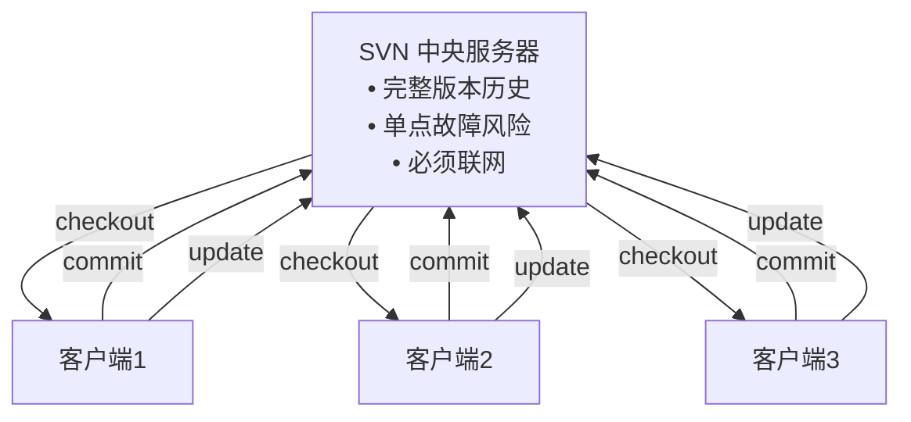
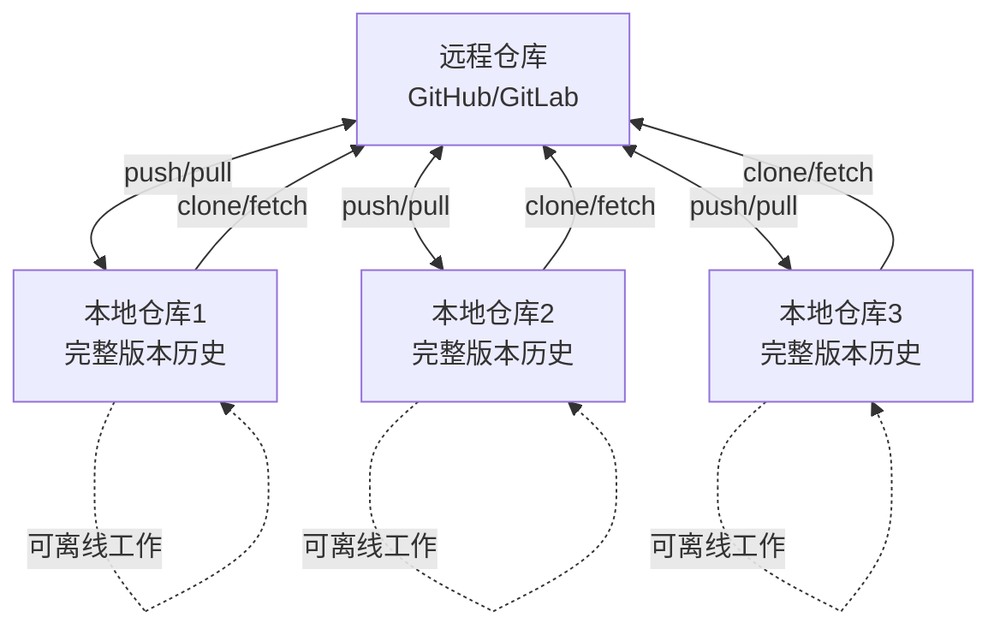
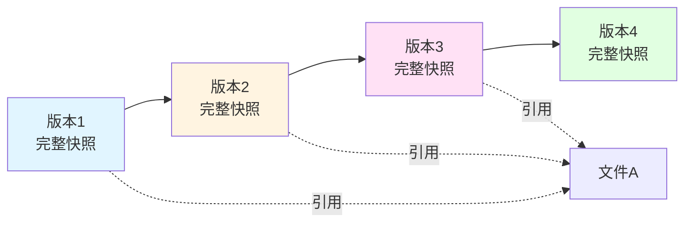
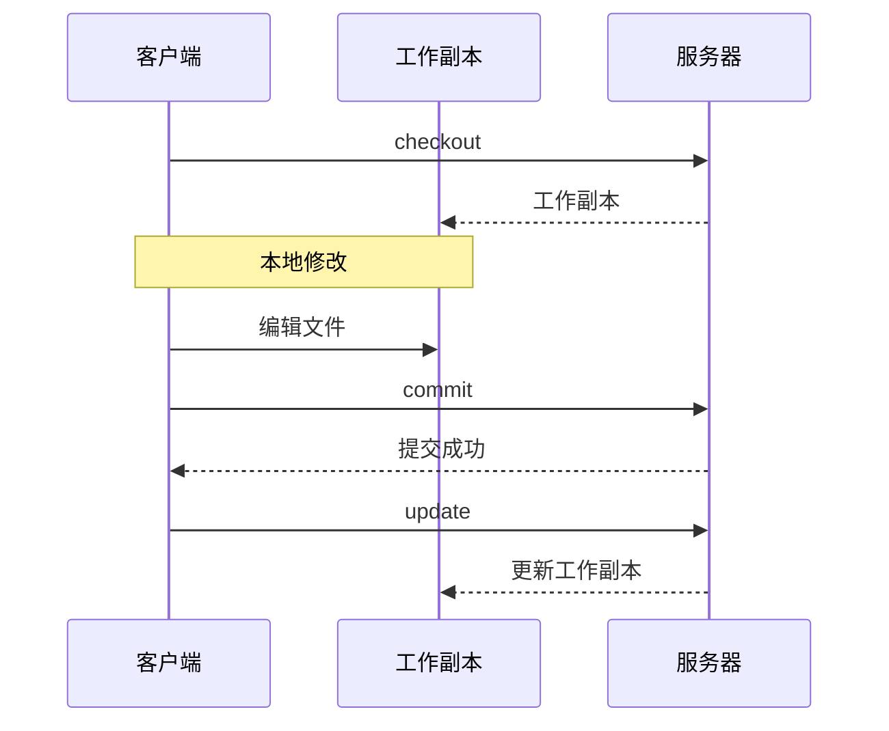
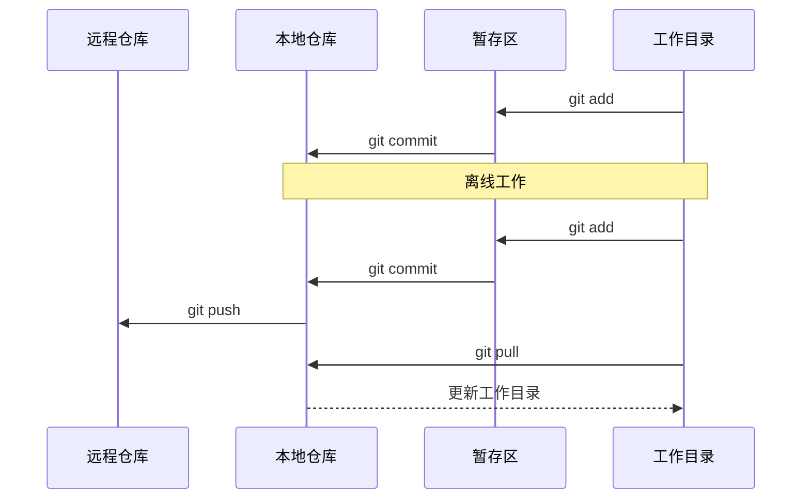
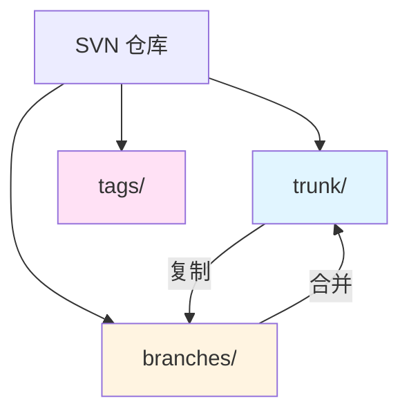
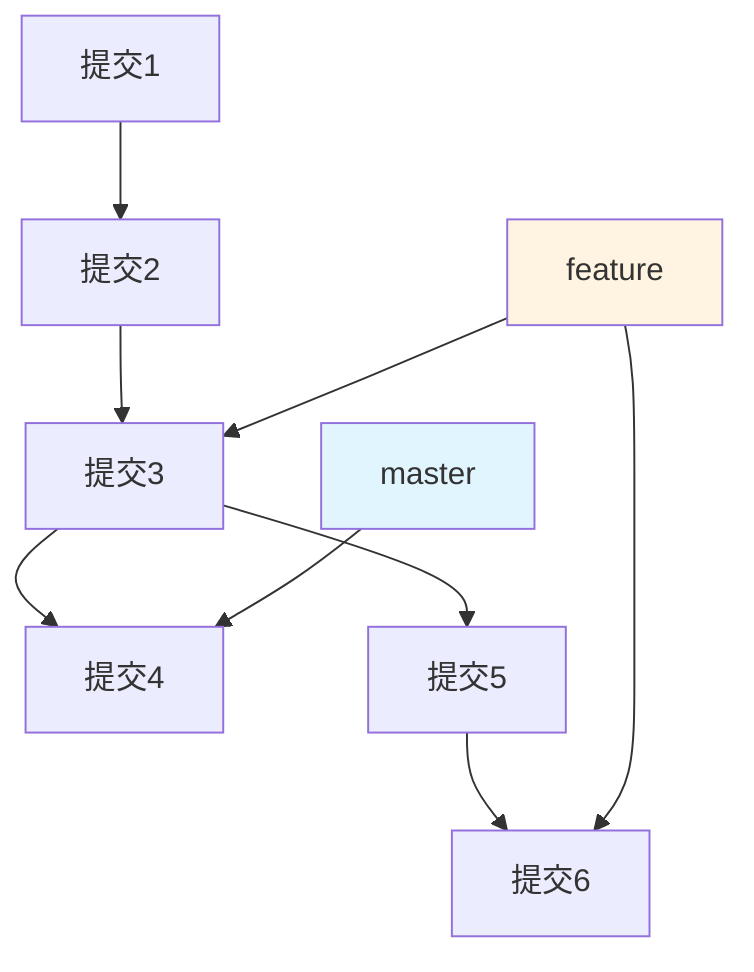

# SVN vs Git 版本控制系统对比

## 一、核心架构对比

### SVN（集中式版本控制）


### Git（分布式版本控制）


## 二、初始化仓库对比

### SVN 初始化
```bash
# 1. 创建服务器端仓库
svnadmin create /path/to/repo

# 2. 导入初始项目结构
svn import /path/to/project file:///path/to/repo -m "Initial import"

# 3. 客户端检出工作副本
svn checkout file:///path/to/repo /path/to/working_copy
# 或使用 URL
svn checkout https://svn.example.com/repo /path/to/working_copy
```

### Git 初始化
```bash
# 1. 初始化本地仓库
git init
# 或克隆远程仓库
git clone https://github.com/user/repo.git

# 2. 添加文件到暂存区
git add .

# 3. 提交到本地仓库
git commit -m "Initial commit"

# 4. 推送到远程仓库（可选）
git remote add origin https://github.com/user/repo.git
git push -u origin master
```

## 三、导入导出对比

### SVN 导入导出
```bash
# 导入项目到仓库
svn import /path/to/project https://svn.example.com/repo -m "Import project"

# 导出特定版本（无版本控制信息）
svn export https://svn.example.com/repo /path/to/export
svn export -r 123 https://svn.example.com/repo /path/to/export

# 导出特定目录
svn export https://svn.example.com/repo/trunk/src /path/to/export
```

### Git 导入导出
```bash
# 克隆仓库（包含完整历史）
git clone https://github.com/user/repo.git

# 导出无版本信息的文件（指定分支）
git archive --format=tar --output=export.tar HEAD
git archive --format=zip --output=export.zip HEAD

# 导出特定目录
git archive --format=tar --output=src.tar HEAD:src/

# 从 SVN 迁移到 Git
git svn clone https://svn.example.com/repo
```

## 四、常用命令对比表

### 基本操作
| 操作类型 | SVN 命令 | Git 命令 | 说明 |
|---------|---------|---------|------|
| **初始化** | `svnadmin create /path` | `git init` | 创建新仓库 |
| **克隆/检出** | `svn checkout URL` | `git clone URL` | 获取仓库副本 |
| **更新** | `svn update` | `git pull` / `git fetch` | 更新本地代码 |
| **查看状态** | `svn status` | `git status` | 查看文件状态 |
| **添加文件** | `svn add file` | `git add file` | 添加到版本控制 |
| **删除文件** | `svn delete file` | `git rm file` | 删除并标记 |
| **移动文件** | `svn move src dst` | `git mv src dst` | 重命名/移动 |
| **提交** | `svn commit -m "msg"` | `git commit -m "msg"` | 提交更改 |

### 分支管理
| 操作类型 | SVN 命令 | Git 命令 | 说明 |
|---------|---------|---------|------|
| **创建分支** | `svn copy trunk branches/feature` | `git branch feature` | 创建新分支 |
| **切换分支** | `svn switch branches/feature` | `git checkout feature` | 切换工作分支 |
| **合并分支** | `svn merge branches/feature` | `git merge feature` | 合并分支 |
| **删除分支** | `svn delete branches/feature` | `git branch -d feature` | 删除分支 |
| **查看分支** | `svn list branches/` | `git branch` | 列出所有分支 |

### 历史查看
| 操作类型 | SVN 命令 | Git 命令 | 说明 |
|---------|---------|---------|------|
| **查看日志** | `svn log` | `git log` | 查看提交历史 |
| **查看差异** | `svn diff` | `git diff` | 查看文件差异 |
| **查看详情** | `svn info` | `git show` | 查看详细信息 |
| **回滚** | `svn merge -c -123` | `git revert commit` | 撤销特定提交 |
| **重置** | `svn update -r 123` | `git reset --hard` | 回退到指定版本 |

### 远程操作
| 操作类型 | SVN 命令 | Git 命令 | 说明 |
|---------|---------|---------|------|
| **推送** | `svn commit` | `git push` | 提交到远程 |
| **拉取** | `svn update` | `git pull` | 从远程更新 |
| **查看远程** | N/A | `git remote -v` | 查看远程仓库 |
| **标签管理** | `svn copy trunk tags/v1.0` | `git tag v1.0` | 创建版本标签 |

## 五、核心概念对比

### 1. 版本存储模型

#### SVN（增量式）


#### Git（快照式）


### 2. 工作流程对比

#### SVN 工作流程


#### Git 工作流程


### 3. 分支模型对比

#### SVN 分支（目录复制）


#### Git 分支（指针）


## 六、优缺点对比

### SVN 优势
- ✅ 权限管理更精细（目录级别）
- ✅ 二进制文件处理更好
- ✅ 对大文件支持更友好
- ✅ 学习曲线相对平缓
- ✅ 中央控制便于审计

### SVN 劣势
- ❌ 必须联网才能提交
- ❌ 分支管理繁琐
- ❌ 单点故障风险
- ❌ 合并冲突处理复杂
- ❌ 无法离线查看历史

### Git 优势
- ✅ 完全分布式，支持离线工作
- ✅ 分支管理简单快速
- ✅ 本地拥有完整历史
- ✅ 合并和重写历史能力强
- ✅ 丰富的工具生态

### Git 劣势
- ❌ 学习曲线陡峭
- ❌ 对大文件仓库性能下降
- ❌ 权限管理相对简单
- ❌ 历史不可变（需特殊操作）

## 七、迁移场景

### 从 SVN 迁移到 Git
```bash
# 1. 使用 git-svn 工具
git svn clone https://svn.example.com/repo --authors-file=authors.txt

# 2. 转换作者映射
# authors.txt 格式：
# svn_user = Git User <git@example.com>

# 3. 推送到新的 Git 仓库
git remote add origin https://github.com/user/repo.git
git push -u origin all branches
git push --tags
```

### 选择建议
- **使用 SVN 的场景**：
  - 企业内部集中式管理需求
  - 大型二进制文件项目（如游戏资源）
  - 需要细粒度权限控制
  - 传统行业、保守型团队

- **使用 Git 的场景**：
  - 开源项目
  - 需要频繁分支实验
  - 分布式团队协作
  - 现代敏捷开发流程
  - DevOps/CI/CD 集成需求

## 八、总结

| 特性 | SVN | Git |
|-----|-----|-----|
| **架构** | 集中式 | 分布式 |
| **分支** | 目录复制 | 指针引用 |
| **历史** | 服务器端 | 完整本地副本 |
| **网络** | 必须联网 | 支持离线 |
| **学习难度** | 中等 | 较高 |
| **性能** | 大文件优秀 | 小型项目优秀 |
| **工具生态** | 相对简单 | 非常丰富 |

---

*最后更新：2026-03-26*
